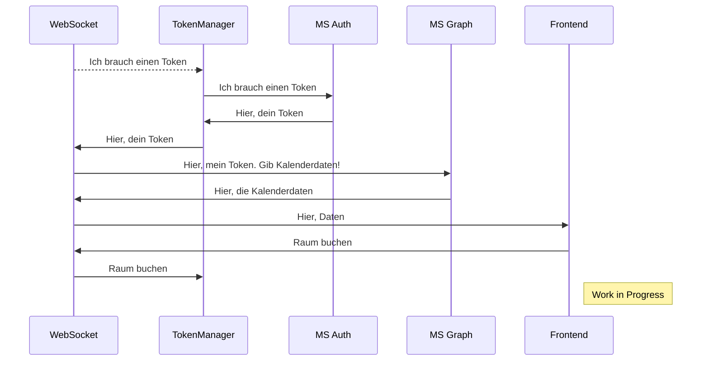

Eine kleine **Webanwendung** zum Buchen eines Konferenzraumes. Die Verbindung läuft über einen *WebSocket*. 

Sofern die passende .env Datei korrekt hinterlegt ist, autorisiert das Tool "Konferenzraum01" und erhält einen Token, welcher Lokal abgespeichert wird. Dieser wird durch einen *TokenManager* für weitere Anfragen verwaltet und bei Bedarf aktualisiert.  Dies wird benötigt um z.B. die Kalenderdaten des Raumes abzurufen und im Frontend darzustellen.


## Features

 1. GUI für schnellen Überblick über Raumbuchungen
 2. Anzeige der gebuchten Termine
       -   Anzeige des gebuchten Zeitslots
       -   Anzeige Titel
       -   Anzahl teilnehmende Personen | auf zwei begrenzt. Weitere werden durch "+x weitere" dargestellt
 3.   Automatische Authentifizierung des Raumes
	  -   mit der passender .env Datei wird Token bei Microsoft Auth erfragt und gespeichert
	  -   in dieser Version gilt das für "Konferenzraum 01"
 4.   Token aktualisiert sich automatisch
 5.   Automatischer Austausch von Daten mit MS Graph
		-   Termine aus Raumkalender (Outlook) werden abgerufen und in einer JSON gespeichert
		-   es werden nur Termine ab der jeweiligen laufenden Woche berücksichtigt
 6.   JSON Datei als Zwischenspeicher für gelesene Termine aus MS Graph
		 -   die JSON wird anschließend vom Script für die GUI benötigt
 7.   Sortierung der Events nach chronologischer Reihenfolge des Starttermins
 8.   Countdown bis zum nächsten Meeting in Kartenansicht
 9.   Kalenderansicht über einen ToggleButton erreichbar
 10.   Formular zum Buchen von neuen Meetings
		 -   Bereits belegte Zeitslots werden farblich gekennzeichnet
 11.   Lokal ausführbar - dank HTML!

## Installation
1. Es ist notwendig, dass das System **nodes** verarbeiten kann. Bitte erkundige dich wie du diese installierst, da diese je nach Betriebssystem variiert. 
2. Die folgenden *nodes* müssen im Ordner **.\backend** installiert bzw. hinterlegt werden. Navigiere hierzu in das passende Unterverzeichnis des Projektes, bis am Ende folgendes steht:
```bash
./backend
```
3. Installiere die folgenden *nodes* mit dem jeweiligen Bashbefehl:

### dotenv
```bash
npm install dotenv
```
> **Anmerkung:** : Wird benötigt, da das Projekt mit einer.env Datei arbeitet. Diese bleibt anschließend "geheim" und wird nicht mit GitHub synchronisiert. Mehr dazu in einem späteren Schrit.

### ws
```bash
npm install ws 
```     
> **Anmerkung:** Wird benötigt, um einen lokalen Server bzw. den WebSocket zu starten und um **POST** und **GET** **REQUESTS** an MS Graph zu kommunizieren. Außerdem ermöglicht es die "bookings.json" zu verändern bzw. zu überschreiben oder anzulegen.

### axios
```bash
npm install axios 
```
> **Anmerkung:** Wird für die POST und GET Anfragen an MS Graph benötigt. Ohne diese Bibliothek können die entsprechenden Befehle nicht verarbeitet oder geändert werden.

## Starten der Anwendung

### Server starten

1. Navigiere im Terminal einer Entwicklungsumgebung z.B. VSC in den Ordner .\backend. 

> **Beispiel:** C:\Users\User\OneDrive\Programme\Raumbuchung\backend"

3. Führe folgenden Befehl im Terminal aus
```bash
node websocket-server.js
```    

Wenn alles korrekt konfiguriert ist, erscheint im Log
```bash
 "WebSocket-Server läuft auf ws://localhost:5500" 
```  
  
Sollte hier etwas anderes erscheinen, kontrolliere ob das Verzeichnis korrekt aufgerufen wurde. 

### Anwendung aufrufen

Sobald der Server läuft, kann dieser über   einen Browser und der Webadresse
```bash
http://127.0.0.1:5500/frontend/dashboard.html    
```  
aufgerufen werden. Der Port kann nach Bedarf im Skript geändert werden. 

### Server stopen
Die Tastenkombination STRG + C beendet den Server. Dies ist nötig, wenn Änderungen an den Servereinstellungen vorgenommen werden z.B. setIntervall.

## Terminal Logs

```bash
access_token: 'dasd....cafafasfasf'
Access Token erfolgreich aktualisiert: 'dasd....cafafasfasf'
```  
Dieser Log erscheint, wenn der Token erneuert oder geändert wurde. Außerdem handelt sich hierbei um eine Debugging Funktion um die Token zu vergleichen, falls es Probleme damit geben sollte.

---

```bash
Kalenderdaten erfolgreich gespeichert.    
```  
Diese Meldung erscheint bei laufendem Server immer, wenn die booking.json überschrieben bzw. neu erstellt wurde. Dies geschieht alle 5 Minuten. 

---

```bash
Neuer Client verbunden: ::1    
``` 
Dieser Log erscheint, wenn das Formular zum buchen des Raumes geöffnet wurde. Die Zahl dient als Indikator, welcher Client sich verbunden hat. Dient vor allem zur Überprüfung, ob die Kommunikation zwischen WebSocket und Formular funktioniert.

---

```bash
Client hat Verbindung geschlossen.   
``` 
Diese Meldung erscheint, wenn das Formular wieder geschlossen wurde. Dies kann durch das Verhalten von Nutzern entstehen, sowie auch durch den Reload des Formulars. 

Ein Reload passiert leider alle 5 Minuten, da die Buchungen von MS Graph neu geladen bzw. gespeichert werden und das Formular die neuen Daten verarbeitet um z.B. geblockte Zeiten auszugrenzen.

---


## Fixed

### GUI
- Buttons "Raum buchen" und "Dashboard" sind nun klickbare Buttons
- Lokalisierung vom Framework "FullCalender" funktioniert nun
- Aktuelles Meeting werden korrekt dargestellt
- Dashboard zeigt MEZ/MESZ statt UTC an
- Countdown rechnet mit MEZ/MESZ statt UTC
- Formular nun funktional   
- Zeitliche Differenzen zwischen Anwendung und Outlook behoben    

## Bekannte Fehler

### GUI
- Formular passt sich "Landscape"-Ansicht noch nicht an
- setIntervall lädt das Formular neu. Dadurch gehen bereits getätigte Eingaben verloren
